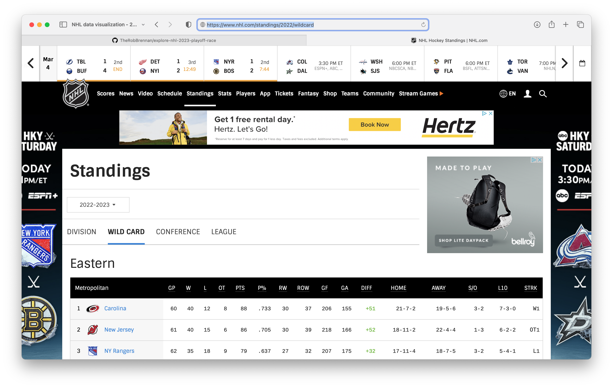
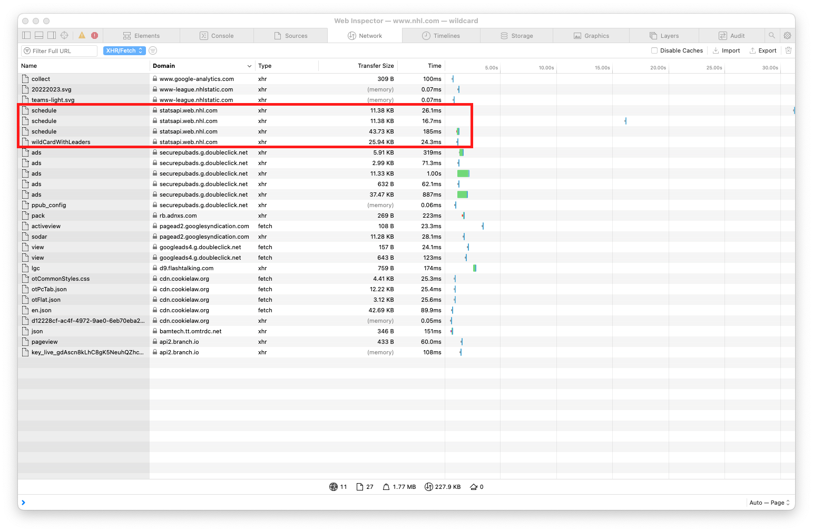
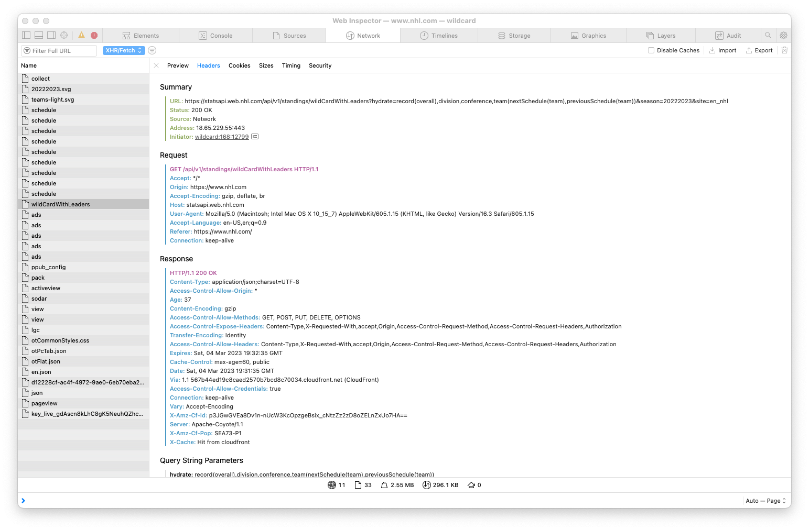
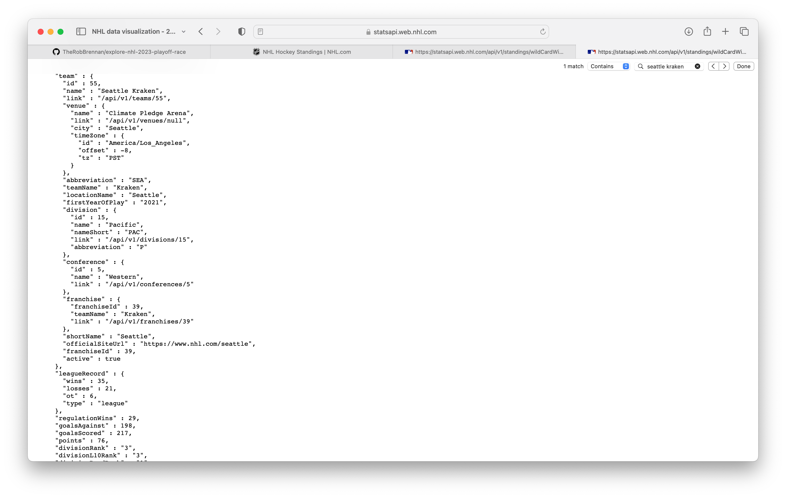
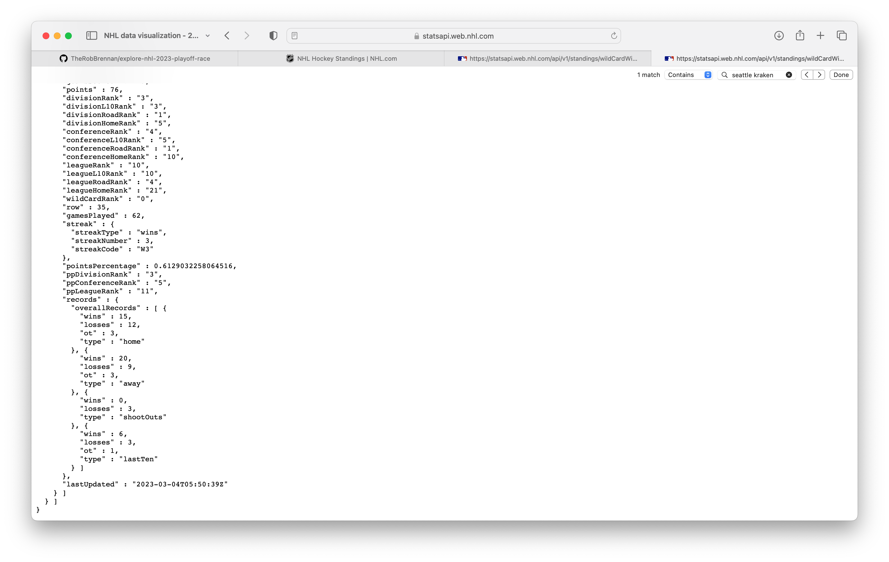
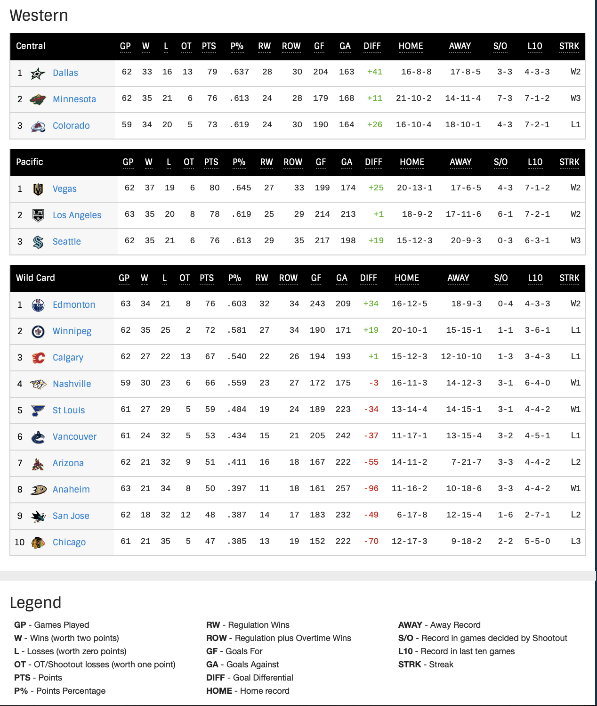
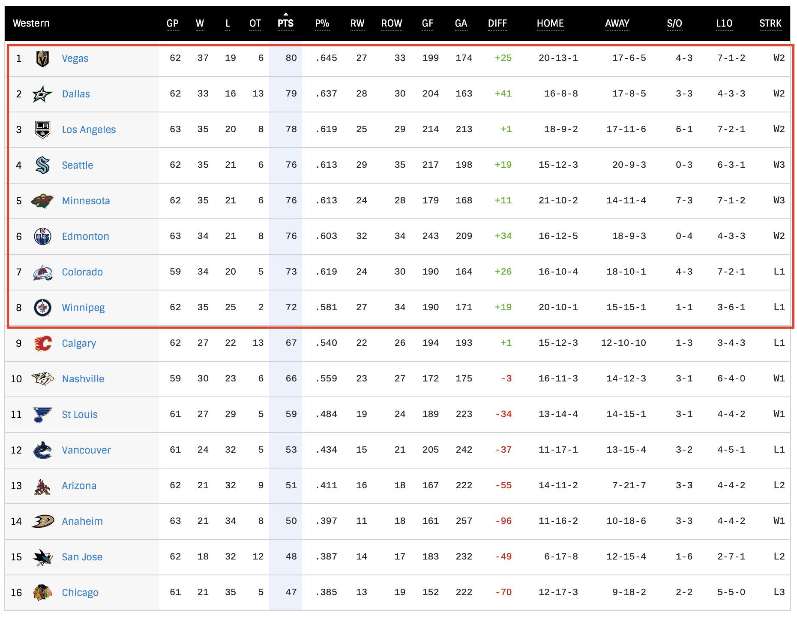
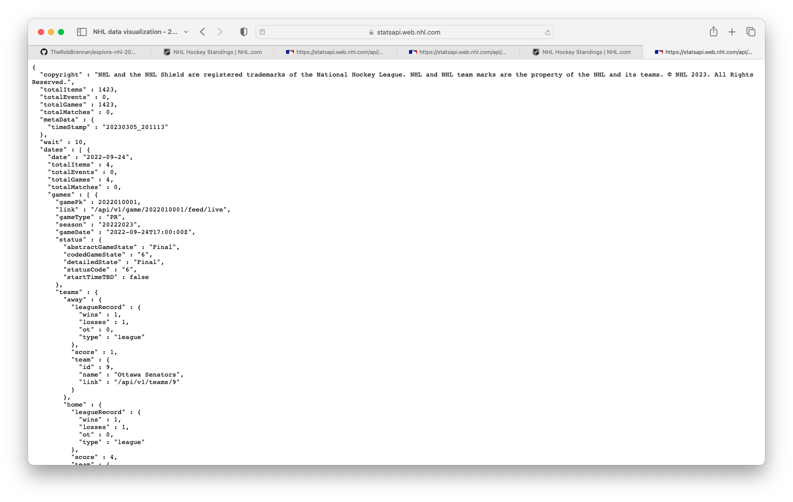
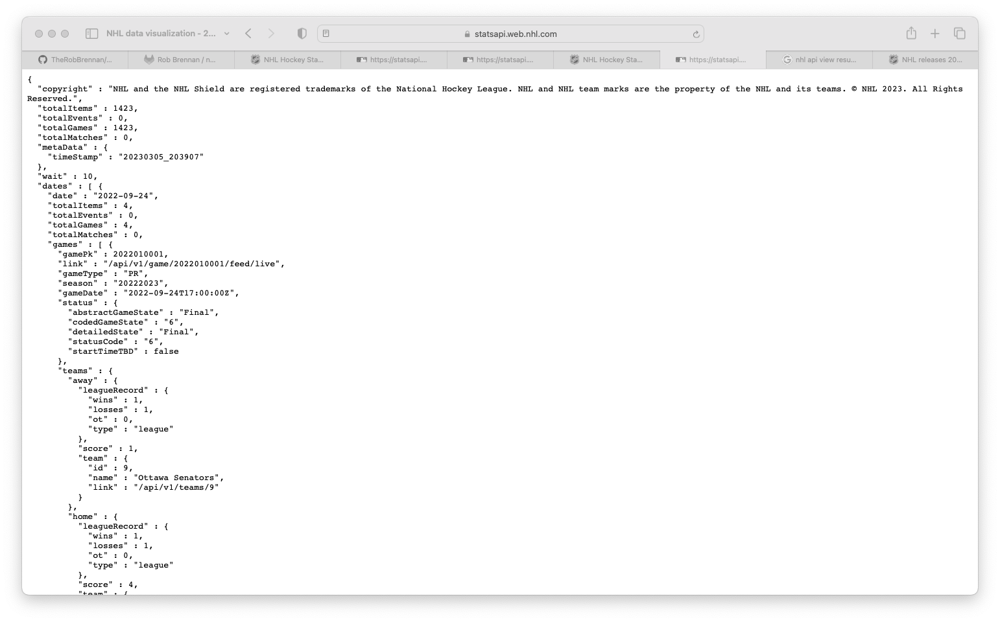
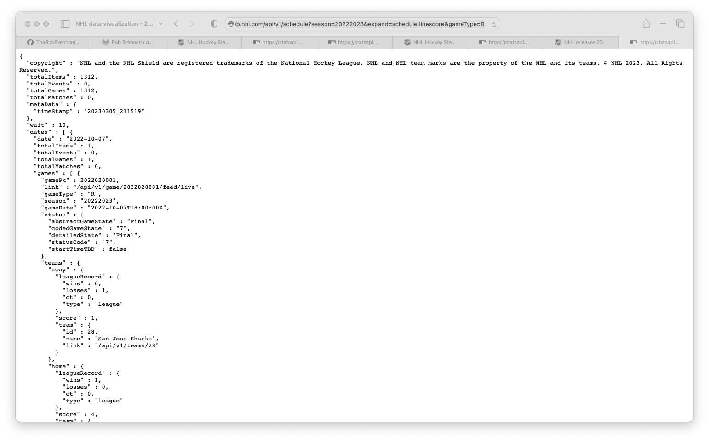

# Welcome

What kind of data is available for us to work with using the official NHL API?

## Current standings

Let's view the Wild Card standings for the NHL 2022-23 season at [https://www.nhl.com/standings/2022/wildcard](https://www.nhl.com/standings/2022/wildcard):



If we use the Safari Web Inspector and select the `Network` tab to view traffic, let's zero in on the `statsapi.web.nhl.com` domain:



Let's select `wildCardWithLeaders`:



Let's look at the URL - [https://statsapi.web.nhl.com/api/v1/standings/wildCardWithLeaders?hydrate=record(overall),division,conference,team(nextSchedule(team),previousSchedule(team))&season=20222023&site=en_nhl](https://statsapi.web.nhl.com/api/v1/standings/wildCardWithLeaders?hydrate=record(overall),division,conference,team(nextSchedule(team),previousSchedule(team))&season=20222023&site=en_nhl) - and the [JSON](./json/wildCardWithLeaders.json) data it provides:


### Experiment 01 - Simplify our NHL standings data

Now that we know how to access standings data let's see if we can simplify and slim down the large JSON response from the original request.

What happens if we change [https://statsapi.web.nhl.com/api/v1/standings/wildCardWithLeaders?hydrate=record(overall),division,conference,team(nextSchedule(team),previousSchedule(team))&season=20222023&site=en_nhl](https://statsapi.web.nhl.com/api/v1/standings/wildCardWithLeaders?hydrate=record(overall),division,conference,team(nextSchedule(team),previousSchedule(team))&season=20222023&site=en_nhl) to [https://statsapi.web.nhl.com/api/v1/standings/wildCardWithLeaders?hydrate=record(overall),division,conference,team&season=20222023&site=en_nhl](https://statsapi.web.nhl.com/api/v1/standings/wildCardWithLeaders?hydrate=record(overall),division,conference,team&season=20222023&site=en_nhl)?

See [wildCardWithLeaders-experiment-01.json](./json/wildCardWithLeaders-experiment-01.json) for an example response to this modified request.

Let's search for the `Seattle Kraken` and see what data we can access:




#### TIMEOUT: What are we trying to build?

What are we trying to build? The NHL playoff picture for the Western Conference is determined by the top three teams in each division and the first two teams in the wild card standings:



Looking at the current Western Conference standings, we can see the six division leaders and the first two wild card teams in positions 1-8 of the conference. It should be noted that the conference rank is based on total points earned (teams earn 2 points for a win in regulation, overtime, or a shootout - or 1 point for a loss in overtime or a shootout) - which is why we see the top two wild card teams from our previous example - Edmonton and Winnipeg, respectively - as ranked 6th and 8th in the Western Conference standings:



Note that as of this writing - Saturday, March 4th, 2023, at 12:19pm PST - the top six teams in the Western Conference are only separated by 4 points! If any team hits a slight slump of 2-3 losing games, these positions could shift dramatically. How cool is that?

#### Let's look at data for the Seattle Kraken

Let's take a look at the Seattle Kraken data we're working within [wildCardWithLeaders-experiment-01.json](./json/wildCardWithLeaders-experiment-01.json):

```json
        {
          "team": {
            "id": 55,
            "name": "Seattle Kraken",
            "link": "/api/v1/teams/55",
            "venue": {
              "name": "Climate Pledge Arena",
              "link": "/api/v1/venues/null",
              "city": "Seattle",
              "timeZone": {
                "id": "America/Los_Angeles",
                "offset": -8,
                "tz": "PST"
              }
            },
            "abbreviation": "SEA",
            "teamName": "Kraken",
            "locationName": "Seattle",
            "firstYearOfPlay": "2021",
            "division": {
              "id": 15,
              "name": "Pacific",
              "nameShort": "PAC",
              "link": "/api/v1/divisions/15",
              "abbreviation": "P"
            },
            "conference": {
              "id": 5,
              "name": "Western",
              "link": "/api/v1/conferences/5"
            },
            "franchise": {
              "franchiseId": 39,
              "teamName": "Kraken",
              "link": "/api/v1/franchises/39"
            },
            "shortName": "Seattle",
            "officialSiteUrl": "https://www.nhl.com/seattle",
            "franchiseId": 39,
            "active": true
          },
          "leagueRecord": {
            "wins": 35,
            "losses": 21,
            "ot": 6,
            "type": "league"
          },
          "regulationWins": 29,
          "goalsAgainst": 198,
          "goalsScored": 217,
          "points": 76,
          "divisionRank": "3",
          "divisionL10Rank": "3",
          "divisionRoadRank": "1",
          "divisionHomeRank": "5",
          "conferenceRank": "4",
          "conferenceL10Rank": "5",
          "conferenceRoadRank": "1",
          "conferenceHomeRank": "10",
          "leagueRank": "10",
          "leagueL10Rank": "10",
          "leagueRoadRank": "4",
          "leagueHomeRank": "21",
          "wildCardRank": "0",
          "row": 35,
          "gamesPlayed": 62,
          "streak": {
            "streakType": "wins",
            "streakNumber": 3,
            "streakCode": "W3"
          },
          "pointsPercentage": 0.6129032258064516,
          "ppDivisionRank": "3",
          "ppConferenceRank": "5",
          "ppLeagueRank": "11",
          "records": {
            "overallRecords": [
              {
                "wins": 15,
                "losses": 12,
                "ot": 3,
                "type": "home"
              },
              {
                "wins": 20,
                "losses": 9,
                "ot": 3,
                "type": "away"
              },
              {
                "wins": 0,
                "losses": 3,
                "type": "shootOuts"
              },
              {
                "wins": 6,
                "losses": 3,
                "ot": 1,
                "type": "lastTen"
              }
            ]
          },
          "lastUpdated": "2023-03-04T05:50:39Z"
        }

```

If we manually review and trim the above data to fields that will be useful for us to work with, we might end up with something like this:

```json
        {
          "team": {
            "id": 55,
            "name": "Seattle Kraken",
          },
          "leagueRecord": {
            "wins": 35,
            "losses": 21,
            "ot": 6,
            "type": "league"
          },
          "regulationWins": 29,
          "points": 76,
          "divisionRank": "3",
          "conferenceRank": "4",
          "leagueRank": "10",
          "wildCardRank": "0",
          "gamesPlayed": 62,
          "lastUpdated": "2023-03-04T05:50:39Z"
        }

```

#### Let's look at data for the Winnipeg Jets

If we look at a similar subset of data for Winnipeg - currently in second place for the wild card - we see:

```json
        {
          "team": {
            "id": 52,
            "name": "Winnipeg Jets",
            },
          "leagueRecord": {
            "wins": 35,
            "losses": 25,
            "ot": 2,
            "type": "league"
          },
          "regulationWins": 27,
          "points": 72,
          "divisionRank": "4",
          "conferenceRank": "8",
          "leagueRank": "14",
          "wildCardRank": "2",
          "gamesPlayed": 62,
          "lastUpdated": "2023-03-04T05:50:39Z"
        },
```

### Experiment 02 - How might we view team points changing over a period of time?

Let's explore using the `schedule` endpoint to see if we can dynamically access points earned for games earlier in the season.

#### NHL 2022-2023 schedule

Let's look at the URL - [https://statsapi.web.nhl.com/api/v1/schedule?season=20222023](https://statsapi.web.nhl.com/api/v1/schedule?season=20222023) - and the [JSON](./json/schedule-complete-experiment-02.json) data it provides:



Swing and a miss. We don't have any game details available to us. Let's try another approach.

##### Add the linescore to our schedule

We can add the linescore of the game by adding a new `&expand=schedule.linescore` parameter to our URL - [https://statsapi.web.nhl.com/api/v1/schedule?season=20222023&expand=schedule.linescore](https://statsapi.web.nhl.com/api/v1/schedule?season=20222023&expand=schedule.linescore) - and review the [JSON](./json/schedule-complete-expand-schedule-linescore-experiment-02.json) data it provides:



In this example, we are starting with the first preseason game of the year - on September 24th, 2022, between the Ottawa Senators and Toronto Maple Leafs.

##### Filter schedule to regular season games

We can filter the results so that only regular season games are loaded by adding a new `&gameType=R` parameter to our URL - [https://statsapi.web.nhl.com/api/v1/schedule?season=20222023&expand=schedule.linescore&gameType=R](https://statsapi.web.nhl.com/api/v1/schedule?season=20222023&expand=schedule.linescore&gameType=R) - and review the [JSON]() data it provides:



The 2022-2023 NHL season's regular season started on October 7th, 2022.

🎉 We can use this data to iterate over each game and dynamically keep track of points for each team in the conference. 🎉
